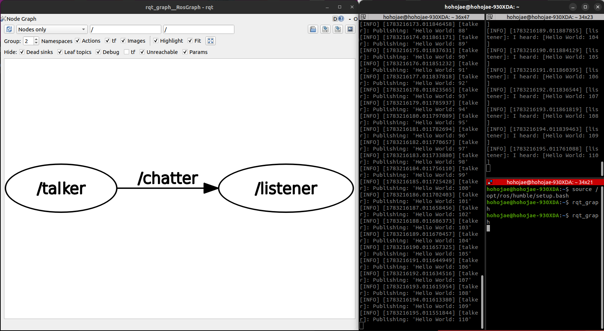
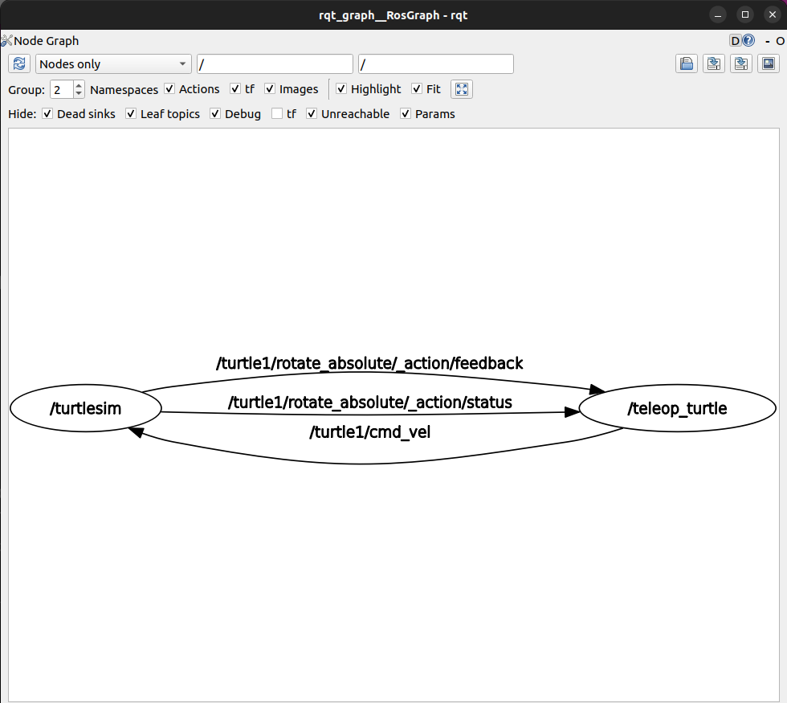

# ROS2 노드(Node) 개념 및 통신 구조 학습

## 1. ROS2에서 노드(Node)란?
ROS2에서 **노드(Node)**는 로봇 시스템을 구성하는 가장 기본적이고 독립적인 실행 단위입니다.
하나의 거대한 프로그램을 만드는 대신, 카메라 제어 노드, 모터 구동 노드, 경로 탐색 노드 등 각각의 기능을 수행하는 작은 노드들로 나누어 개발합니다. 이 노드들은 서로 메시지(데이터)를 주고받으며 상호작용하여 전체 로봇 시스템을 구동합니다. 이러한 구조는 코드의 재사용성을 높이고 오류 발생 시 디버깅을 쉽게 만들어 줍니다.

## 2. Talker와 Listener 노드의 관계
`demo_nodes_cpp` 패키지의 데모를 실행한 결과, `talker` 노드는 지속적으로 메시지를 발행(Publish)하고, `listener` 노드는 그 메시지를 구독(Subscribe)하여 화면에 출력하는 단방향 통신 구조를 가짐을 확인했습니다.

### [ rqt_graph 실행 결과 ]

### [ ros2 node 명령어 확인 ]
* `ros2 node list`를 통해 현재 실행 중인 `/talker`와 `/listener` 노드의 존재를 확인했습니다.
* `ros2 node info <노드이름>`을 통해 해당 노드가 어떤 토픽(Topic)으로 데이터를 주고받는지(Publishers/Subscribers 정보 등) 구체적인 연결 상태를 터미널에서 텍스트로 확인할 수 있었으며, 이는 `rqt_graph`의 시각적 결과와 정확히 일치했습니다.

## 3. Turtlesim 노드 실행 및 관계 정리
Turtlesim 패키지를 통해 실행된 두 노드는 사용자의 입력과 화면 출력을 담당하며 상호작용합니다.

1. **`/teleop_turtle` 노드:** 사용자의 키보드 방향키 입력을 받아 제어 명령(속도 및 방향) 데이터를 생성하여 발행합니다.
2. **`/turtlesim` 노드:** 제어 명령 데이터를 수신(구독)하여 파란색 화면의 거북이를 해당 방향과 속도만큼 실제로 움직이게 시뮬레이션합니다.

### [ Turtlesim rqt_graph 실행 결과 ]
