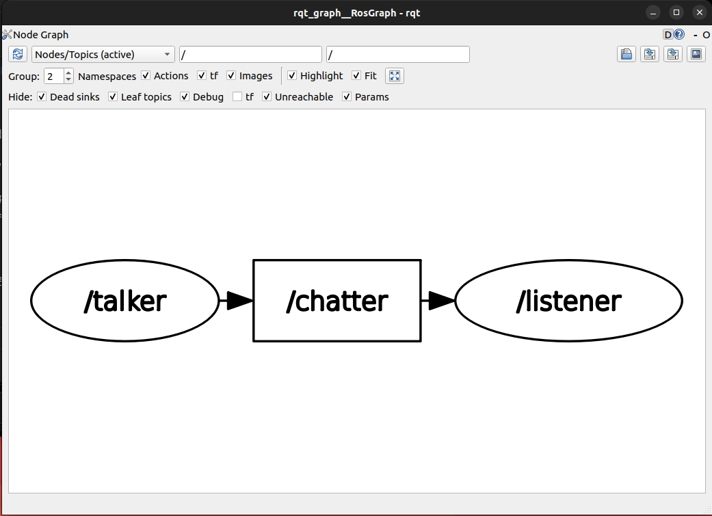
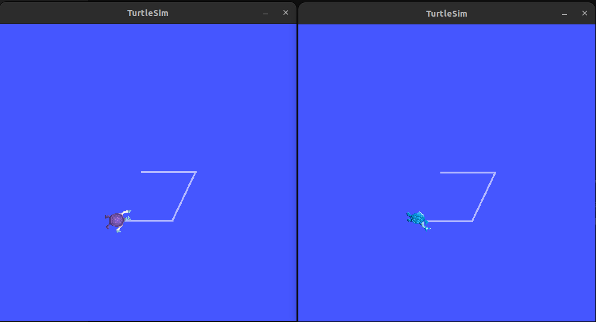

# 문제 7: 인체는 신경계, 로봇은 토픽(Topic)

## 1. ROS2 토픽(Topic)의 개념
인체가 신경계를 통해 각 기관에 신호를 전달하듯, ROS2에서 **토픽(Topic)**은 노드 간에 데이터를 주고받는 핵심 통신 버스(Bus) 역할을 합니다. 
게시자(Publisher)가 특정 주제(Topic)로 메시지를 발행하면, 해당 주제에 관심이 있는 구독자(Subscriber)들이 그 메시지를 비동기적(단방향)으로 받아보는 구조입니다.

## 2. demo_nodes_cpp 패키지 실습 결과
### 2.1. rqt_graph 확인 (Nodes/Topics active 모드)

* **방향성 확인:** `talker` 노드에서 나온 화살표가 `/chatter`라는 토픽을 거쳐 `listener` 노드로 들어가는 단방향 데이터 흐름을 명확히 확인할 수 있습니다.

### 2.2. ros2 topic 명령어 실행 결과
* **`ros2 topic list`**: 현재 시스템에서 활성화된 모든 토픽의 목록을 출력합니다. (`/chatter`, `/rosout` 등)
* **`ros2 topic info /chatter`**: 해당 토픽의 메시지 타입(`std_msgs/msg/String`)과 현재 퍼블리셔(1), 서브스크라이버(1)의 개수를 보여줍니다.
* **토픽의 내용 (info 결과)** '''text
  hohojae@hohojae-930XDA:~$ ros2 topic info /chatter
    Type: std_msgs/msg/String
    Publisher count: 1
    Subscription count: 1
* **`ros2 topic echo /chatter`**: 해당 토픽에 실제로 어떤 데이터가 흐르고 있는지 터미널 화면에 실시간으로 출력합니다. (예: `data: 'Hello World: 1'`)
* **토픽의 내용 (echo 결과)** '''text
  hohojae@hohojae-930XDA:~$ ros2 topic echo /chatter
    data: 'Hello World: 387'
    ---
    data: 'Hello World: 388'
    ---
    data: 'Hello World: 389'
    ---
    data: 'Hello World: 390'
    ---
    data: 'Hello World: 391'
    ---

### 2.3. ROS2 기본 메시지 유형 (std_msgs)
`std_msgs`는 ROS2에서 기본적으로 제공하는 표준 데이터 타입 패키지입니다. `String`(문자열), `Int32`(정수), `Float64`(실수), `Bool`(참/거짓) 등 가장 기초적인 데이터 형태를 정의하고 있습니다.

### 2.4. 노드 실행 수에 따른 퍼블리셔/서브스크라이버 변화
* **1 Talker, 2 Listener:** 퍼블리셔 1개, 서브스크라이버 2개 (1:N 통신). 하나의 메시지를 두 구독자가 동시에 받습니다.
* **토픽의 내용 (info 결과)** '''text
  hohojae@hohojae-930XDA:~$ source /opt/ros/humble/setup.bash
  hohojae@hohojae-930XDA:~$ ros2 topic info /chatter
    Type: std_msgs/msg/String
    Publisher count: 1
    Subscription count: 2
* **2 Talker, 1 Listener:** 퍼블리셔 2개, 서브스크라이버 1개 (N:1 통신). 두 노드가 뱉는 메시지를 하나의 구독자가 모두 받습니다.
* **토픽의 내용 (info 결과)** '''text
  hohojae@hohojae-930XDA:~$ source /opt/ros/humble/setup.bash
  hohojae@hohojae-930XDA:~$ ros2 topic info /chatter
    Type: std_msgs/msg/String
    Publisher count: 2
    Subscription count: 1
* **2 Talker, 2 Listener:** 퍼블리셔 2개, 서브스크라이버 2개 (N:N 통신). 다대다 통신이 유기적으로 이루어집니다.
* **토픽의 내용 (info 결과)** '''text
  hohojae@hohojae-930XDA:~$ source /opt/ros/humble/setup.bash
  hohojae@hohojae-930XDA:~$ ros2 topic info /chatter
    Type: std_msgs/msg/String
    Publisher count: 2
    Subscription count: 2
* **결론:** 토픽은 단순한 1:1 통신 선이 아니라, **"게시판"**과 같습니다. 글을 쓰는 사람(Pub)이 몇 명이든, 읽는 사람(Sub)이 몇 명이든 상관없이 독립적으로 작동하는 유연한 통신 방식입니다.

## 3. turtlesim 패키지를 통한 토픽 실습
### 3.1. 두 개의 turtlesim_node 실행 결과

키보드로 `turtle_teleop_key`를 조작하면 **두 개의 창에 있는 거북이가 완전히 똑같은 방향과 속도로 동시에 움직입니다.**

### 3.2. /turtle1/cmd_vel 토픽 정보 분석
* **게시자와 구독자의 수:** Publisher: 1개 (teleop_key), Subscriber: 2개 (두 개의 turtlesim_node)
* **토픽 형태의 정보 (Type):** `geometry_msgs/msg/Twist` (직진 속도인 linear와 회전 속도인 angular 정보를 담는 메시지 타입)
* **토픽의 내용 (echo 결과):** ```text
  linear:
    x: 2.0
    y: 0.0
    z: 0.0
  angular:
    x: 0.0
    y: 0.0
    z: -2.0
  linear:
    x: 2.0
    y: 0.0
    z: 0.0
  angular:
    x: 0.0
    y: 0.0
    z: 0.0
  linear:
    x: 0.0
    y: 0.0
    z: 0.0
  angular:
    x: 0.0
    y: 0.0
    z: 2.0
  linear:
    x: 0.0
    y: 0.0
    z: 0.0
  angular:
    x: 0.0
    y: 0.0
  z: 2.0
  linear:
    x: 2.0
    y: 0.0
    z: 0.0
  angular:
    x: 0.0
    y: 0.0
    z: 0.0
  linear:
    x: 2.0
    y: 0.0
    z: 0.0
  angular:
    x: 0.0
    y: 0.0
    z: -2.0
  linear:
    x: 2.0
    y: 0.0
    z: 0.0
  angular:
    x: 0.0
    y: 0.0
    z: -2.0
  linear:
    x: -2.0
    y: 0.0
    z: 0.0
  angular:
    x: 0.0
    y: 0.0
    z: 0.0
  linear:
    x: -2.0
    y: 0.0
    z: 0.0
  angular:
    x: 0.0
    y: 0.0
    z: 0.0
  linear:
    x: 0.0
    y: 0.0
    z: 0.0
  angular:
    x: 0.0
    y: 0.0
    z: 0.0