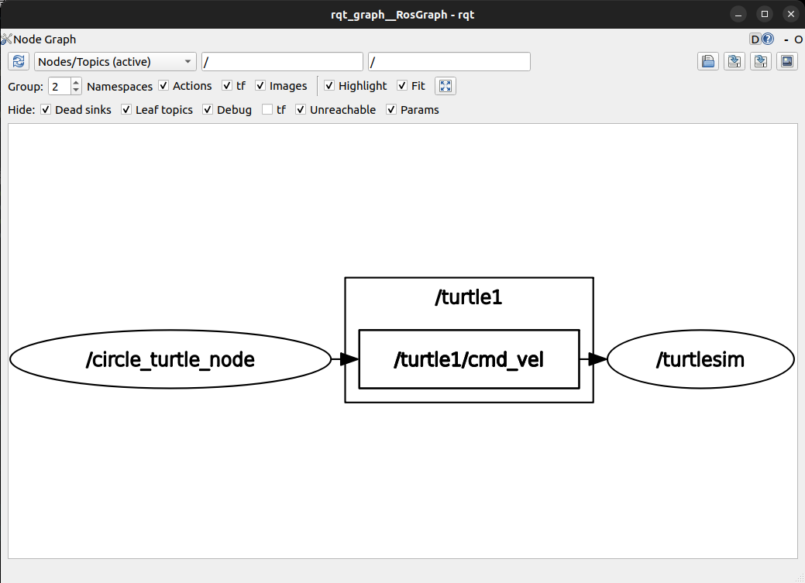
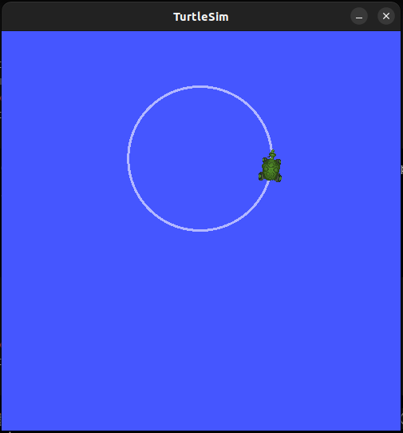

# 문제 8: 누군가는 정보를 만들어내고 (Publisher)

## 1. 발행(Publish)과 구독(Subscribe)의 통신 구조
ROS2에서 노드 간의 통신은 메시지를 뿜어내는 **발행자(Publisher)**와 메시지를 받아먹는 **구독자(Subscriber)**의 비동기적 토픽 통신 구조를 가집니다. 퍼블리셔는 구독자가 현재 존재하든 존재하지 않든 상관없이 지정된 토픽 이름으로 데이터를 지속적으로 발행하며, 서브스크라이버는 해당 토픽이 활성화되면 데이터를 수신합니다.

## 2. turtlesim_node와 turtle_teleop_key 통신 구조 분석
* **토픽 이름:** `/turtle1/cmd_vel`
* **토픽 유형(Type):** `geometry_msgs/msg/Twist`
* **개별 값들의 의미:**
  * `linear` (선속도 벡터, m/s 단위): `x`는 전진 및 후진 속도, `y`는 좌우 측면 이동 속도, `z`는 상하 수직 이동 속도를 의미합니다. (차륜형 로봇은 주로 x축만 사용)
  * `angular` (각속도 벡터, rad/s 단위): `x`는 롤(Roll), `y`는 피치(Pitch), `z`는 요(Yaw, 회전) 속도를 의미합니다. (평면 주행 로봇은 주로 z축만 사용)

## 3. 의존성(Dependency) 추가의 의미와 이유
* **의존성 추가의 의미:** 해당 패키지가 정상적으로 빌드되고 실행되기 위해 반드시 선행되어 설치 및 참조되어야 하는 외부 라이브러리나 다른 ROS2 패키지를 지정하는 행위입니다.
* **추가 이유:**
  * `geometry_msgs`: 로봇에게 속도 명령을 내리기 위한 `Twist` 메시지 클래스 정의를 참조하기 위해 필수적입니다.
  * `turtlesim`: 거북이 시뮬레이터 노드 환경 및 해당 토픽 인터페이스 명세와의 연동을 명확히 하기 위해 추가합니다.

## 4. 파이썬 퍼블리셔 구현 및 실행 결과
`circle_turtle.py` 파일을 작성하여 `linear.x = 2.0`, `angular.z = 1.0` 의 값을 10Hz(`create_timer(0.1, ...)`) 주기로 계속 발행하도록 구현했습니다. 이로 인해 선속도 대비 각속도의 비율에 따라 일정한 반지름을 가진 부드러운 원형 궤적 주행이 일어남을 확인했습니다.

### 4.1. rqt_graph 분석 결과

우리가 파이썬 코드로 직접 구현한 `circle_turtle_node`가 퍼블리셔가 되어 `/turtle1/cmd_vel` 토픽 버스에 제어 메시지를 공급하고, `turtlesim` 노드가 이를 안정적으로 구독하여 구동되는 관계를 성공적으로 도식화했습니다.

### 4.2. 거북이 원형 주행 시뮬레이션 결과

퍼블리셔 노드가 발행하는 제어 명령(선속도 2.0, 각속도 1.0)에 따라 거북이가 일정한 궤적의 원을 그리며 주행하는 모습입니다.
