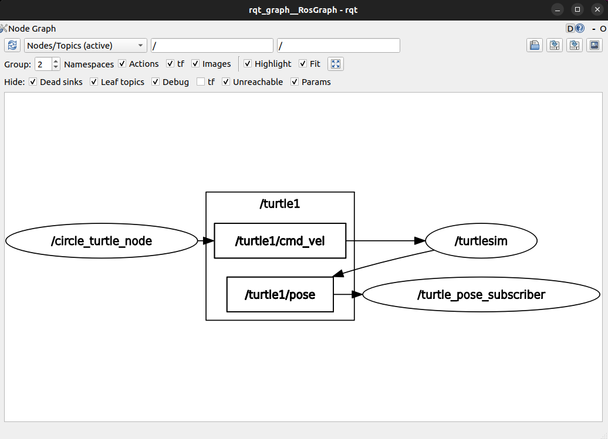

[200~# 문제 9: 누군가는 정보를 받아가고 (Subscriber)

## 1. 서브스크라이버(Subscriber) 생성 방법
파이썬에서 ROS2 서브스크라이버는 `Node` 클래스의 `create_subscription(메시지타입, '토픽이름', 콜백함수, 큐사이즈)` 메서드를 사용하여 생성합니다. 퍼블리셔와 다르게, 메시지가 토픽으로 들어올 때마다 자동으로 실행될 **콜백(Callback) 함수**를 반드시 연결해 주어야 합니다.

## 2. /turtle1/pose 토픽 및 메시지 유형 분석
* **토픽 설명:** `turtlesim_node`가 자신의 현재 위치(x, y), 바라보는 방향(theta), 그리고 현재 움직이는 속도(linear, angular) 정보를 주기적으로 뿜어내는 상태 브로드캐스팅 토픽입니다.
* **메시지 유형:** `turtlesim/msg/Pose`
* **실행 결과 (`ros2 topic info /turtle1/pose`):**
  ```text
  Type: turtlesim/msg/Pose
  Publisher count: 1
  Subscription count: 0

### 2.1. ros2 interface show 명령어의 역할
`ros2 interface show <메시지_타입>` 명령어는 해당 메시지 타입이 내부적으로 어떤 자료형(Data Type)들로 구성되어 있는지 그 뼈대를 뜯어볼 수 있게 해줍니다.
* **실행 결과 (`ros2 interface show turtlesim/msg/Pose`):**
  ```text
  float32 x
  float32 y
  float32 theta
  float32 linear_velocity
  float32 angular_velocity
  ```

## 3. 서브스크라이버 구현 및 동작 결과
`turtle_pose.py`에 구현한 콜백 함수는 이전 상태 변수(`prev_x`, `prev_y`, `prev_theta`)를 저장해 두고, 새로 수신된 메시지의 위치/방향 값과 비교합니다. 거북이가 이동하여 값이 변경되었을 때만 `get_logger().info()`를 통해 터미널에 좌표를 출력하도록 설계되었습니다. `circle_turtle` 노드와 동시 실행 시 지속적으로 갱신되는 좌표를 확인할 수 있었습니다.

### 3.1. rqt_graph 분석 결과

그래프를 통해 ROS2의 핵심인 비동기 통신망을 확인할 수 있습니다.
1. `circle_turtle_node`가 속도 명령(`cmd_vel`)을 퍼블리시합니다.
2. `turtlesim` 노드가 명령을 구독해 움직이며, 동시에 자신의 바뀐 위치(`pose`)를 퍼블리시합니다.
3. 방금 생성한 `turtle_pose_subscriber` 노드가 그 위치를 구독해 터미널에 출력하는 완벽한 릴레이 구조가 형성되었습니다.~
