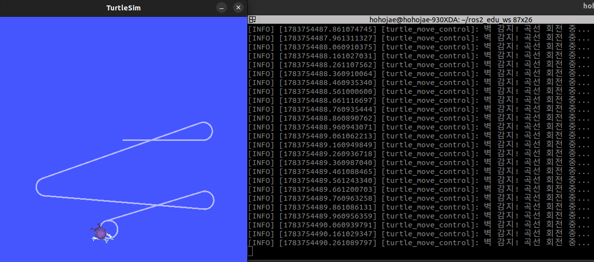

[200~# 문제 10: 누군가는 정보를 만들면서 받아가기도 (Closed-loop Control)

## 1. 폐쇄 루프(Closed-loop) 시스템의 이해
지금까지 실습한 내용들은 일방적으로 명령을 내리거나(퍼블리셔) 듣기만 하는(서브스크라이버) '개방형(Open-loop)' 시스템이었습니다. 하지만 이번 과제에서는 로봇이 **자신의 센서 데이터(현재 위치)를 구독하여 피드백을 받고, 그 피드백을 바탕으로 새로운 제어 명령을 발행하는 '폐쇄 루프(Closed-loop)'** 자율 제어 시스템을 구현했습니다.

## 2. 제어 노드(turtle_move_control) 구현 로직
* **토픽 구독 (Subscriber):** `/turtle1/pose` 토픽을 실시간으로 구독하여 로봇의 현재 `x`, `y` 좌표를 받아옵니다.
* **상황 판단 (로직):** turtlesim의 맵 크기는 약 11.08 x 11.08 입니다. 로봇의 좌표가 벽면에서 `2.0` 마진 이내로 진입하면 `turn_mode`를 `True`로 변경하여 충돌 위험을 알립니다.
* **토픽 발행 (Publisher):** `timer_callback`을 통해 10Hz(0.1초) 주기로 `/turtle1/cmd_vel` 토픽을 발행합니다. 
  * 안전 구역일 때: 빠른 속도로 직진 (`linear.x = 3.0`)
  * 위험 구역(`turn_mode == True`)일 때: 선속도를 줄이고 각속도를 높여 곡선을 그리며 회피 (`linear.x = 1.0`, `angular.z = 2.5`)

## 3. 동작 및 구조 분석 결과
로봇을 실행한 결과, 지정된 로직에 따라 벽에 부딪히지 않고 맵 내부를 자유롭게 돌아다니는 완벽한 자율 회피 주행을 확인했습니다.

### 3.1. rqt_graph 분석 결과

그래프를 통해 **완벽한 순환 제어 고리**를 확인할 수 있습니다.
1. `turtle_move_control` 노드가 `/turtle1/cmd_vel`을 퍼블리시하여 거북이를 움직이게 합니다.
2. `turtlesim` 노드는 그 명령을 수행함과 동시에 바뀐 자신의 위치를 `/turtle1/pose`로 브로드캐스팅합니다.
3. 'turtle_move_control' 노드는 다시 그 위치를 서브스크라이브하여 다음 이동 방향을 결정하는 완벽한 피드백 루프를 형성합니다.
