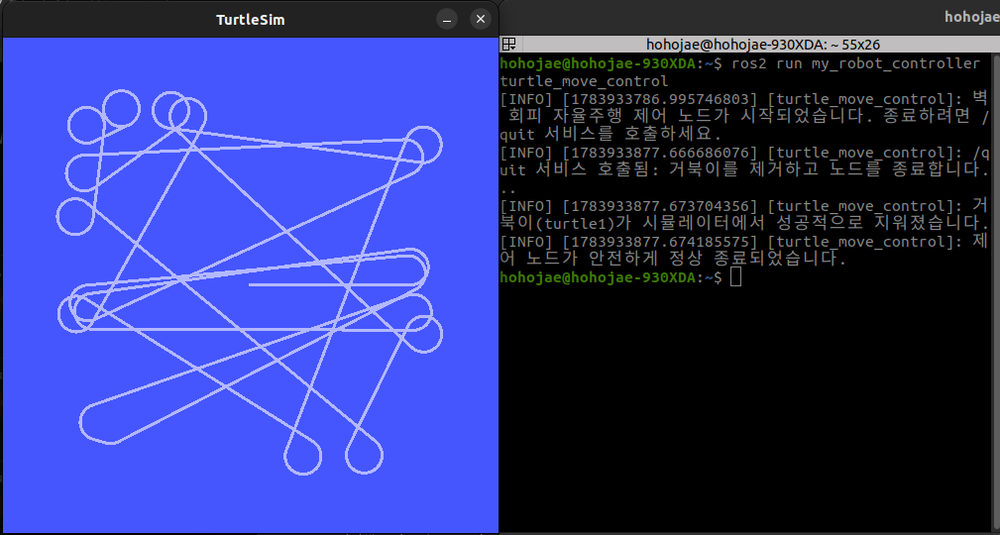

# 문제 11: 좋은 로봇은 다양한 서비스를 제공한다. (Service Server/Client)

## 1. ROS2 서비스(Service)의 개념
토픽(Topic)이 데이터를 끊임없이 뿜어내는 '방송'이라면, 서비스(Service)는 필요할 때만 서버에 요청(Request)하고 결과(Response)를 받아오는 '콜택시(클라이언트-서버)' 방식의 동기식/비동기식 양방향 통신입니다.

## 2. demo_nodes_cpp 패키지 서비스 실습
* `add_two_ints_server` 노드를 실행한 뒤, CLI 환경에서 동작을 확인했습니다.
* **서비스 목록 확인:** `ros2 service list`
***실행 결과 (`ros2 service list`):**
```text
/add_two_ints
/add_two_ints_server/describe_parameters
/add_two_ints_server/get_parameter_types
/add_two_ints_server/get_parameters
/add_two_ints_server/list_parameters
/add_two_ints_server/set_parameters
/add_two_ints_server/set_parameters_atomically
```

* **서비스 정보 확인:** `ros2 service type /add_two_ints` -> `example_interfaces/srv/AddTwoInts`

* **명령행 서비스 호출:** `ros2 service call /add_two_ints example_interfaces/srv/AddTwoInts "{a: 5, b: 7}"` 호출 결과 `sum: 12`의 정상 반환을 확인했습니다.
***실행 결과 (`ros2 service call /add_two_ints example_interfaces/srv/AddTwoInts "{a: 5, b: 7}"`):**
```text
requester: making request: example_interfaces.srv.AddTwoInts_Request(a=5, b=7)

response:
example_interfaces.srv.AddTwoInts_Response(sum=12)
```

## 3. 예외 없는 정상 종료(Graceful Shutdown) 방법
파이썬 노드에서 강제로 스크립트를 끊으면 처리되지 않은 예외(Unhandled Exception)가 발생합니다. 이를 막기 위해 메인 스핀 영역(`try: rclpy.spin(node)`)에서 `KeyboardInterrupt`와 `SystemExit` 예외를 명시적으로 `except`로 잡아주었습니다. 종료 조건이 만족되었을 때 코드 내부에서 `raise SystemExit`를 발생시키면, 빨간색 에러 로그 없이 깔끔하게 `finally` 구문을 타고 메모리를 정리(`destroy_node`, `shutdown`)하며 프로그램이 닫힙니다.

## 4. 파이썬 비동기(Async) 처리 방식 및 서비스 연동 결과
* 제어 노드에 외부에서 호출 가능한 `/quit` 서비스(서버)를 추가했습니다.
* `/quit`이 호출되면 `turtlesim`의 `/kill` 서비스(클라이언트)를 **비동기 방식(`call_async`)**으로 호출합니다. 
* 동기 방식(`call`)을 쓰면 응답이 올 때까지 노드가 멈춰버리지만, `call_async`와 `add_done_callback(완료 시 실행할 함수)`를 사용하면 서비스 처리를 기다리는 동안에도 노드는 멈추지 않고 자기 할 일을 정상적으로 수행할 수 있습니다.

### 4.1. 서비스 호출 및 정상 종료(Graceful Shutdown) 확인

위 화면은 자율주행 중인 로봇에게 '/quit' 서비스를 호출한 직후의 결과입니다. 좌측 시뮬레이터 창에서 거북이가 즉시 제거되었으며, 우측 터미널 로그를 통해 처리되지 않은 예외(Unhandled Exception) 발생 없이 **"안전하게 정상 종료되었습니다"**라는 메시지와 함께 노드가 깔끔하게 종료된 것을 명확히 확인할 수 있습니다.