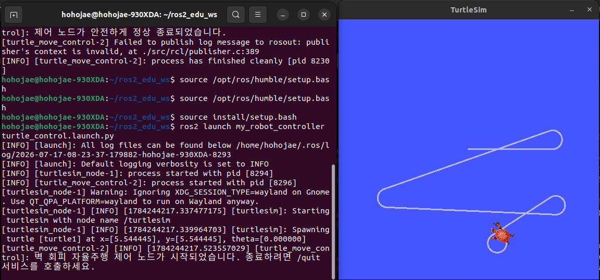

# 문제 12: 로봇의 부팅이 너무 복잡하다. (Launch File)

## 1. ROS2 Launch File의 개념 및 필요성
실제 로봇 시스템(자율주행, SLAM 등)은 센서, 제어기, 통신 등 수십 개의 노드가 동시에 동작해야 합니다. 이를 사용자가 일일이 `ros2 run`으로 터미널을 여러 개 띄워 실행하는 것은 비효율적입니다. Launch 파일은 **여러 노드를 동시에 실행하고, 파라미터를 한 번에 설정하며, 노드 간의 실행 순서나 의존성을 관리**하는 역할을 하는 ROS2 시스템 구동의 핵심 스크립트입니다.

## 2. Launch 파일 작성 및 setup.py 설정
* ROS2 Humble 버전에서는 **Python 스크립트** 기반의 런치 파일 작성을 표준으로 사용합니다. (`LaunchDescription`과 `Node` 객체 활용)
* 이번 실습에서는 `turtlesim_node`(기성품 패키지)와 직접 작성한 폐쇄 루프 제어 노드(`turtle_move_control`)를 하나의 런치 파일 안에 묶어 동시에 실행되도록 구현했습니다.
* **setup.py 수정:** 작성한 `.launch.py` 파일이 `colcon build` 과정에서 `install` 디렉토리(share/패키지명/launch)로 제대로 복사되어 ROS2 명령어가 찾을 수 있도록 `data_files` 리스트에 `glob`을 활용하여 경로 매핑을 추가해 주었습니다.

## 3. ros2 launch 명령어 활용 결과
* **명령어:** `ros2 launch my_robot_controller turtle_control.launch.py`

### 3.1. 동시 실행 스크린샷 및 로그 분석

위 화면은 `turtle_control.launch.py` 파일을 실행한 직후의 모습입니다. 왼쪽 터미널 창을 보면 `[turtlesim_node-1]`과 `[turtle_move_control-2]` 두 개의 서로 다른 프로세스가 단 하나의 `ros2 launch` 명령어로 동시에 시작(pid 할당)된 것을 확인할 수 있습니다. 이를 통해 복잡한 로봇 시스템을 부팅할 때 Launch 파일이 얼마나 강력한 자동화 도구인지 검증했습니다.

---

## 4. [복기 및 최종 정리] ROS2 파이썬 패키지 구조 (수동 vs 자동)
런치 파일을 포함하여 직접 ROS2 패키지를 구성하는 전체 흐름을 복기해보면, 명령어에 의한 **자동 생성** 부분과 개발자의 **수동 작업** 부분이 명확히 나뉩니다. 

* **자동 생성 (뼈대 구축):** `ros2 pkg create --build-type ament_python my_robot_controller` 명령어 실행 시, 패키지의 큰 뼈대(겉창고)와 파이썬 모듈 폴더(속상자), 그리고 설정 파일(`setup.py`, `package.xml`)이 100% 자동으로 생성됩니다.
* **수동 생성 (살 붙이기):** 속상자 안에 들어갈 실제 파이썬 소스 코드(`.py`)와 다중 실행을 위한 `launch` 폴더 및 런치 파일(`.launch.py`)은 개발자가 직접 생성하고 작성해야 합니다.

### 4.1. 프로젝트 파일 디렉토리 구조도
파이썬 언어 고유의 패키징 규칙에 따라 동일한 이름의 폴더가 2겹으로 구성되는 원리입니다.

```text
📂 src
 ┗ 📂 my_robot_controller (1. 겉창고 - 작업 공간 / 자동 생성)
    ┣ 📜 setup.py (빌드 설정 파일 / 자동 생성)
    ┣ 📜 package.xml (패키지 정보 파일 / 자동 생성)
    ┣ 📂 my_robot_controller (2. 속상자 - 진짜 파이썬 모듈 공간 / 자동 생성)
    ┃  ┣ 📜 __init__.py (파이썬 모듈 인식용 / 자동 생성)
    ┃  ┣ 📜 turtle_move_control.py (직접 작성한 노드 파일)
    ┃  ┗ 📜 turtle_pose.py (직접 작성한 노드파일)
    ┗ 📂 launch (수동으로 만든 폴더)
       ┗ 📜 turtle_control.launch.py (수동 생성)
```