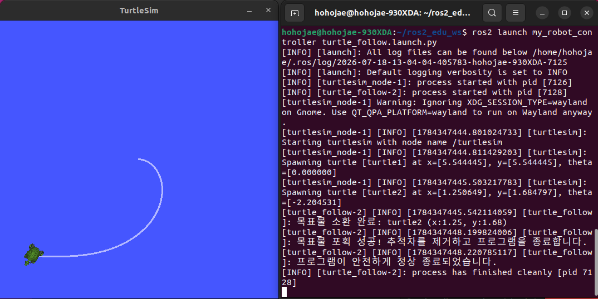

# 문제 13: 재미있는걸 만들어 보자 (ROS2 기초 종합 프로젝트)

## 1. 프로젝트 개요
지금까지 학습한 ROS2 파이썬 프로그래밍의 핵심 요소(Publisher, Subscriber, Service Server/Client, Launch File)를 단일 노드 안에서 유기적으로 통합하여, 지정된 목표물을 스스로 찾아가 포획하는 자율 추적 시스템을 구현하였습니다.

## 2. 제어 알고리즘 및 구현 상세 (`turtle_follow.py`)
* **임의 좌표 목표물 생성 (/spawn 서비스):** 프로그램 초기화 단계에서 타겟 거북이가 기본 거북이(5.5, 5.5)와 겹치지 않도록 **화면의 4개 모서리 구역 중 한 곳을 무작위로 선택**하여 `/spawn` 서비스를 비동기 호출해 소환합니다.
* **추적 제어 로직 (P-Control):** `timer_callback` 내에서 나의 현재 좌표(Subscriber 갱신)와 타겟 좌표 사이의 **유클리드 거리**와 **아크탄젠트(atan2) 각도**를 계산합니다. 거리에 비례하여 선속도를, 각도 차이에 비례하여 회전속도를 조절해 지그재그가 아닌 자연스럽고 부드러운 곡선 궤적을 그리도록 최적화했습니다.
* **종료 및 예외 처리 (Graceful Shutdown):** 
  * 목표물에 도달(거리 0.1 미만)하면 `/kill` 서비스로 추적자(turtle1)를 삭제하고 `SystemExit`를 발생시켜 노드를 정상 종료(에러 로그 방지)합니다.
  * 외부에서 `/quit` 서비스가 호출되면 두 로봇(turtle1, turtle2)을 연속으로 지우고 프로그램을 즉각 종료하는 예외 처리 루틴을 적용했습니다.

## 3. 실행 방법 및 동작 결과
```bash
# 빌드 및 셋업 후 Launch 파일을 통한 일괄 실행
ros2 launch my_robot_controller turtle_follow.launch.py
```

### 3.1. 추적 주행 스크린샷 및 시스템 분석

Launch 파일 실행 직후, 목표물 로봇이 구석에 생성되고 첫 번째 거북이가 이를 인지하여 부드러운 곡선 궤적을 그리며 쫓아가는 모습을 확인할 수 있습니다. 두 로봇이 충돌 반경(0.1) 안에 들어오면 즉각적으로 노드 정상 종료 절차(Graceful Shutdown)가 수행되며 자원이 깔끔하게 해제됩니다.